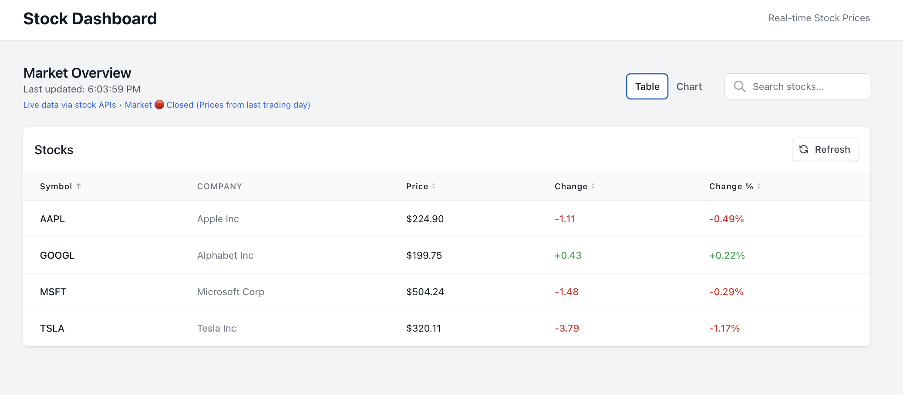
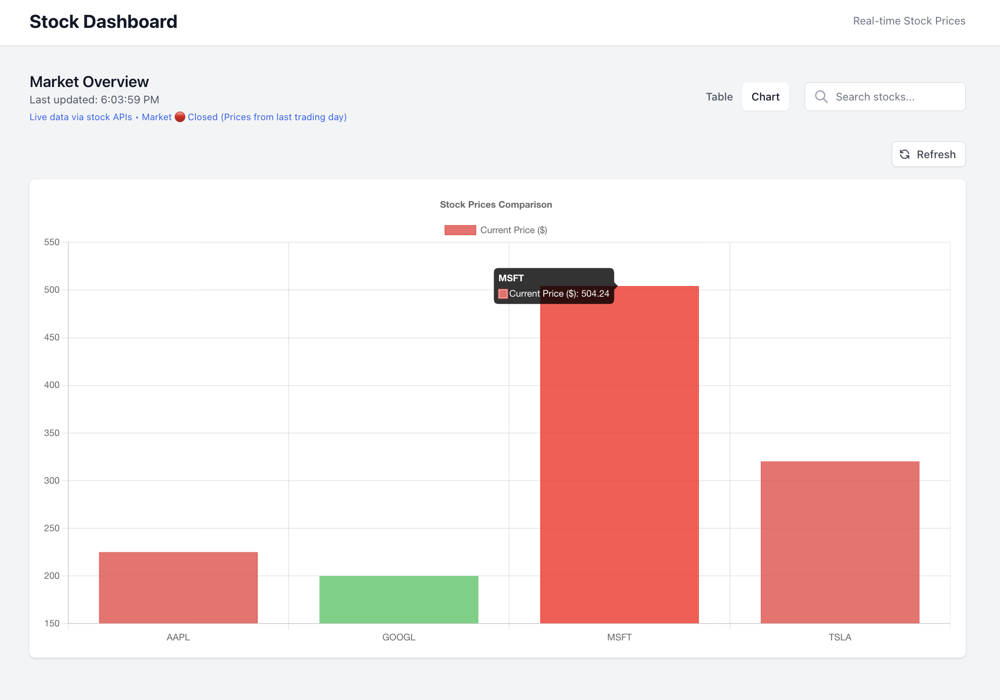

# Stock Dashboard

A modern, responsive stock price dashboard built with React, TypeScript, and Tailwind CSS. Features real-time stock data, interactive charts, and comprehensive table views.

## 📸 Screenshots

### Table View


### Chart View


## 🚀 Features

### Core Features
- **Real-time Stock Data**: Fetches live stock prices using Finnhub API
- **Responsive Design**: Fully responsive layout using Tailwind CSS
- **Interactive Table**: Sortable columns with price, change, and percentage data
- **Search Functionality**: Search stocks by symbol or company name
- **Auto-refresh**: Data automatically refreshes every 30 seconds

### Bonus Features
- **Chart Visualization**: Interactive bar chart using Chart.js
- **Loading States**: Elegant loading spinners and states
- **Error Handling**: Graceful error handling with fallback data
- **View Toggle**: Switch between table and chart views
- **Color-coded Data**: Green/red indicators for gains/losses
- **Market Status Indicator**: Real-time market open/closed status with trading hours
- **Smart Updates**: Displays "Last updated" timestamp and explains after-hours pricing

## 🛠️ Tech Stack

- **Frontend**: React 19.1.1 with TypeScript
- **Styling**: Tailwind CSS v3
- **Charts**: Chart.js with react-chartjs-2
- **API**: Finnhub Stock API
- **Build Tool**: Create React App

## 📦 Installation

1. Install dependencies:
```bash
npm install
```

2. Start the development server:
```bash
npm start
```

3. Open [http://localhost:3000](http://localhost:3000) to view the dashboard

## 🔑 API Configuration

**This application requires a free API key to fetch real stock data.**

### Quick Setup:

**Option 1 - Finnhub (Recommended - 60 calls/minute):**
1. Get a free API key from [Finnhub.io](https://finnhub.io)
2. Create a `.env` file in your project root
3. Add: `REACT_APP_FINNHUB_API_KEY=your_key_here`
4. Restart the development server

**Option 2 - Alpha Vantage (5 calls/minute):**
1. Get a free API key from [Alpha Vantage](https://www.alphavantage.co/support/#api-key)
2. Create a `.env` file in your project root  
3. Add: `REACT_APP_ALPHA_VANTAGE_API_KEY=your_key_here`
4. Restart the development server

### Example .env file:
```bash
# Choose one of these APIs
REACT_APP_FINNHUB_API_KEY=your_finnhub_key_here
# OR
REACT_APP_ALPHA_VANTAGE_API_KEY=your_alpha_vantage_key_here
```

### Rate Limits:
- **Finnhub Free**: 60 calls/minute, 1000 calls/day
- **Alpha Vantage Free**: 5 calls/minute, 500 calls/day

The application automatically handles rate limiting and uses the most appropriate API based on which keys are configured.

## 📱 Responsive Design

The dashboard is fully responsive and works on:
- Desktop computers
- Tablets  
- Mobile devices

## 🎨 Features Overview

### Stock Table
- Sortable by symbol, price, change, and change percentage
- Color-coded positive (green) and negative (red) changes
- Hover effects and smooth transitions
- Refresh button with loading animation

### Chart View
- Bar chart showing stock prices
- Color-coded bars (green for gains, red for losses)
- Responsive chart that adapts to screen size
- Toggle between table and chart views

### Search & Filter
- Real-time search by stock symbol
- Search by company name
- Clear search functionality
- Instant results filtering

### Market Status Features
- **Live Market Indicator**: Shows 🟢 Open (9:30 AM - 4:00 PM EDT) or 🔴 Closed
- **Trading Hours Awareness**: Explains when prices are from the last trading day
- **Smart Refresh Logic**: Updates timestamps to show when data was last fetched
- **Professional UX**: Clear indication of market status and data freshness

## 📊 Default Stocks

The dashboard displays these popular stocks by default:
- AAPL (Apple)
- GOOGL (Google)
- MSFT (Microsoft)
- TSLA (Tesla)

## 🔧 Development

### Available Scripts

- `npm start` - Runs the development server
- `npm run build` - Creates production build
- `npm test` - Runs tests

### Project Structure
```
src/
├── components/          # React components
│   ├── Dashboard.tsx
│   ├── StockTable.tsx
│   ├── StockChart.tsx
│   ├── SearchBar.tsx
│   └── LoadingSpinner.tsx
├── services/           # API services
│   └── finnhubApi.ts
├── types/             # TypeScript types
│   └── Stock.ts
└── App.tsx           # Main app component
```

## 🎯 Future Enhancements

Potential features for future development:
- Portfolio tracking
- Historical price charts
- News feed integration
- Watchlist functionality
- Price alerts
- Dark mode toggle
- Export data functionality

---

*This project was bootstrapped with [Create React App](https://github.com/facebook/create-react-app).*
